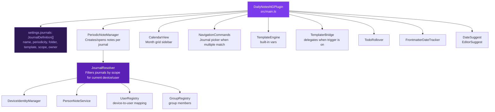
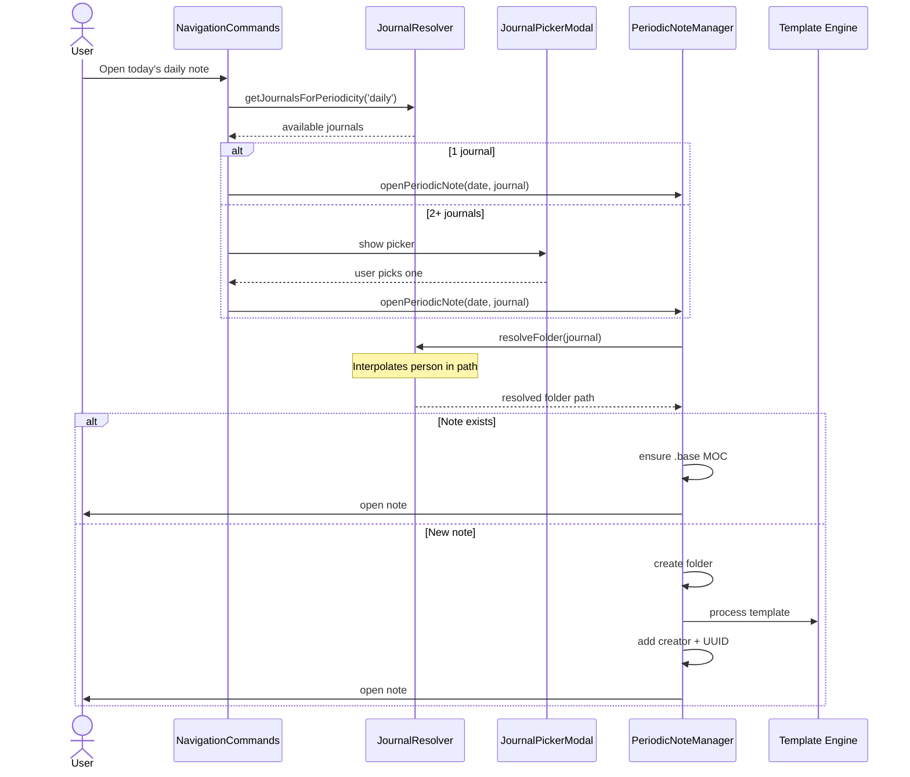
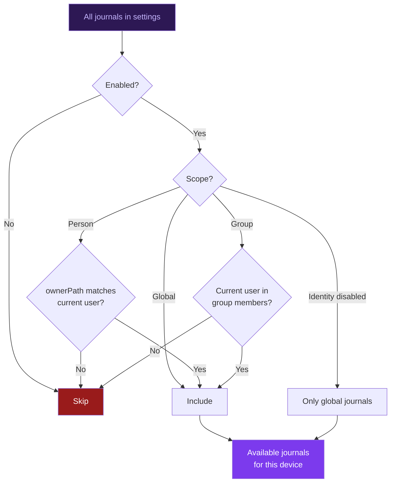

## Module map

## Data flow: creating a periodic note

When a user triggers "Open today's daily note":

## Journal resolution flow

## Storage layers

| Layer | Where | Synced? | Contains |
|-------|-------|---------|----------|
| **localStorage** | Browser | No | Device ID, device preferences |
| **Plugin settings** | `data.json` | Yes | Journal definitions, device-to-user mappings, all config |
| **Person note frontmatter** | `People/Alice.md` | Yes | Person preferences, timezone |
| **Group note frontmatter** | `People/Dev Team.md` | Yes | Group membership list |
| **Note frontmatter** | Any `.md` file | Yes | Note UUID, creator, dates |
| **`.base` MOC** | Journal folder | Yes | Portable Bases query for folder contents |

## Key design decisions

**Why named journals instead of one-per-periodicity?** Users need multiple daily journals (personal, work, team). The old model forced everything into one folder. Named journals let each context have its own destination.

**Why scope-based visibility?** In a shared vault, Alice shouldn't see Bob's personal journal in her command palette. Scopes ensure each device only shows relevant journals.

**Why `{{person}}` interpolation?** For the common case where journals share the same structure per person. `Journal/{{person}}/Daily` avoids duplicating journal definitions for each user.

**Why auto-migration?** Users upgrading from the old per-periodicity config shouldn't lose their settings. The migration converts each enabled periodicity to a global journal.

**Why a journal picker instead of per-journal commands?** Dynamically registering a command for each journal would clutter the command palette. The picker appears only when disambiguation is needed.
