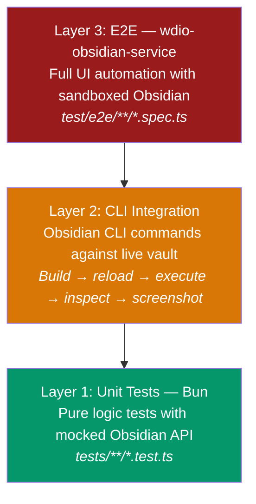

Daily Notes NG uses a multi-layered testing strategy combining unit tests, Obsidian CLI automation, and E2E tests via [wdio-obsidian-service](https://github.com/jesse-r-s-hines/wdio-obsidian-service).

## Testing layers



## Layer 1: Unit tests

Run with Bun's built-in test runner:

```bash
bun test           # Run all tests
bun test --watch   # Watch mode
```

Tests live in `tests/` mirroring the `src/` structure. The Obsidian API is mocked via `tests/preload.ts` (Bun plugin that provides a mock `obsidian` module).

### What to unit test
- [JournalResolver](/obsidian-daily-notes-ng/development/architecture/#journal-resolution-flow) scope filtering and journal availability
- [DevicePreferences](/obsidian-daily-notes-ng/concepts/glossary/#device-id) localStorage read/write
- Frontmatter parsing utilities
- Todo parser (checkbox extraction)
- Date utilities and template variable resolution

### What NOT to unit test
- Obsidian UI components (no DOM in unit tests)
- Plugin lifecycle (onload/onunload)
- File creation (requires real vault)

## Layer 2: Obsidian CLI integration

The [Obsidian CLI](https://help.obsidian.md/cli) (v1.12+) enables testing against a running Obsidian instance from the terminal. This is the primary testing workflow for development.

### Setup

```bash
# Set the CLI alias (WSL2)
OBS="/mnt/c/Users/Cybersader/AppData/Local/Obsidian/Obsidian.com"

# Verify connection
$OBS vault=dnng-test-vault eval "code=1+1"
# => 2
```

> **WSL2 note**: Use `Obsidian.com` (not `.exe`). The `.com` file is a terminal redirector that provides proper stdin/stdout. Requires Catalyst license.

### Build-reload-test cycle

The core development loop:

```bash
# 1. Build and deploy
bun run build && node copy-files.mjs

# 2. Reload plugin in Obsidian
$OBS vault=dnng-test-vault plugin:reload id=daily-notes-ng

# 3. Run a command
$OBS vault=dnng-test-vault eval \
  "code=app.commands.executeCommandById('daily-notes-ng:open-today')"

# 4. Inspect result
$OBS vault=dnng-test-vault eval \
  "code=app.workspace.getActiveFile()?.path"

# 5. Check for errors
$OBS vault=dnng-test-vault dev:errors
```

### Useful CLI commands for testing

```bash
# Inspect plugin settings at runtime
$OBS vault=dnng-test-vault eval \
  "code=JSON.stringify(app.plugins.plugins['daily-notes-ng'].settings.identity, null, 2)"

# List all files in vault
$OBS vault=dnng-test-vault files

# Read a specific note
$OBS vault=dnng-test-vault read path="Test-Journal/Daily/2026-03-24.md"

# Take a screenshot
$OBS vault=dnng-test-vault dev:screenshot

# Check console errors
$OBS vault=dnng-test-vault dev:errors

# List registered commands
$OBS vault=dnng-test-vault commands | grep daily-notes-ng
```

### Testing the identity system via CLI

```bash
# Check current device registration
$OBS vault=dnng-test-vault eval \
  "code=app.plugins.plugins['daily-notes-ng'].userRegistry.getCurrentUser() ?? 'not registered'"

# Inspect all device mappings
$OBS vault=dnng-test-vault eval \
  "code=JSON.stringify(app.plugins.plugins['daily-notes-ng'].settings.identity.deviceUserMappings, null, 2)"
```

## Layer 3: E2E tests (wdio-obsidian-service)

[wdio-obsidian-service](https://github.com/jesse-r-s-hines/wdio-obsidian-service) is a WebDriverIO service purpose-built for Obsidian plugin testing. It automatically downloads Obsidian, runs tests in a sandboxed environment, and supports multi-version testing.

### Why wdio over Playwright?

| Feature | wdio-obsidian-service | Playwright CDP |
|---------|----------------------|----------------|
| Setup | `bun add` + config file | Custom 229-line launcher |
| Obsidian download | Automatic | Manual binary detection |
| Multi-version testing | Built-in (`OBSIDIAN_VERSIONS` env) | Not supported |
| Vault isolation | Sandboxed per run | Manual |
| Trust dialog | Automatic | Custom click logic |
| Command execution | `browser.executeObsidianCommand()` | eval hacks |
| CI/CD | Templates included | DIY |

### Running E2E tests

```bash
# Run all E2E tests
bun run e2e

# Run against specific Obsidian versions
OBSIDIAN_VERSIONS="1.5.0,1.6.0,latest" bun run e2e
```

### Writing E2E tests

Tests live in `test/e2e/` and use Mocha + WebDriverIO syntax:

```typescript
describe('Daily Notes NG', () => {
  it('can open today\'s daily note', async () => {
    await browser.executeObsidianCommand('daily-notes-ng:open-today');
    await browser.waitUntil(async () => {
      const title = await $('.view-header-title');
      return await title.isDisplayed();
    }, { timeout: 10000 });
    const title = await $('.view-header-title');
    await expect(title).toBeDisplayed();
  });

  it('settings tab renders', async () => {
    await browser.executeObsidianCommand('app:open-settings');
    const modal = await $('.modal');
    await expect(modal).toBeDisplayed();
    await browser.keys(['Escape']);
  });
});
```

### When to use E2E vs CLI

| Scenario | Use |
|----------|-----|
| Verify a command works | CLI (`eval + executeCommandById`) |
| Check file was created correctly | CLI (`read`) |
| Inspect settings at runtime | CLI (`eval`) |
| Test modal interactions | E2E (wdio) |
| Test drag-and-drop in calendar | E2E (wdio) |
| Screenshot for documentation | CLI (`dev:screenshot`) |
| Automated regression suite in CI | E2E (wdio) |
| Multi-version compatibility | E2E (wdio) |

## Test fixtures plugin

The [test fixtures plugin](/obsidian-daily-notes-ng/development/test-fixtures/) generates reproducible sample data for testing. Use it to quickly set up and tear down test scenarios:

```bash
# Generate all test data
$OBS vault=dnng-test-vault eval \
  "code=app.commands.executeCommandById('daily-notes-ng-test-fixtures:full-setup')"

# Clean up all test data
$OBS vault=dnng-test-vault eval \
  "code=app.commands.executeCommandById('daily-notes-ng-test-fixtures:remove-all')"
```

## Agentic development workflow

When working with AI coding assistants (Claude Code, etc.), the recommended workflow is:

```
1. Agent writes/modifies source code
2. Agent runs:  bun run build && node copy-files.mjs
3. Agent runs:  $OBS plugin:reload id=daily-notes-ng
4. Agent runs:  $OBS eval "code=..." to test the change
5. Agent runs:  $OBS dev:errors to check for issues
6. Agent reads result and iterates
```

This enables a fully autonomous **build-reload-test** loop without human interaction for most changes.

### Agent-specific tips

- Use `eval` for most testing — it's the most reliable CLI command
- Use `dev:errors` after every reload to catch silent failures
- Use `files folder=<path>` to verify directory structures
- Avoid `plugin:reload` in rapid succession — add `sleep 1` between reload and test
- If CLI hangs, Obsidian may be showing a modal — use `dev:screenshot` to diagnose

## Continuous integration

GitHub Actions runs on every push to `main`:
- **Plugin release** (`.github/workflows/release.yml`): Auto-detects version change, builds, tags, releases
- **Docs deploy** (`.github/workflows/deploy-docs.yml`): Builds Starlight, deploys to GitHub Pages
- **E2E tests** (`.github/workflows/e2e.yml`): Runs wdio-obsidian-service against latest Obsidian
