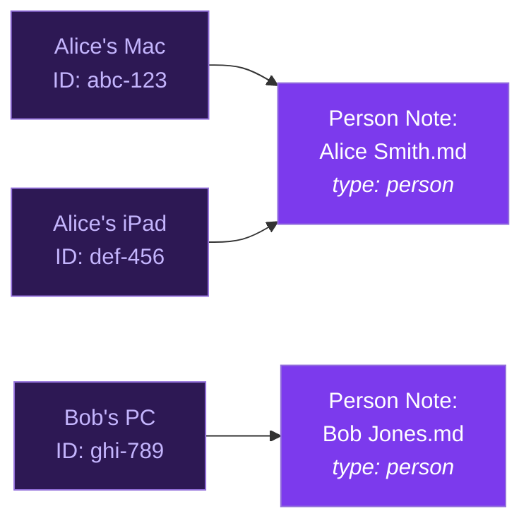
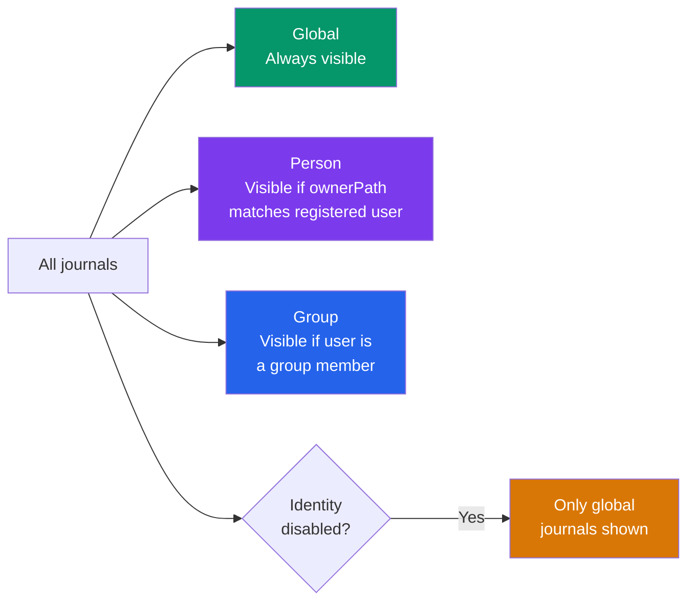

Daily Notes NG supports **multi-user environments** where multiple people share the same vault via Obsidian Sync, git, or any file sync service. This is the feature that differentiates Daily Notes NG from every other periodic notes plugin.

> **New to the terminology?** See the [glossary](/obsidian-daily-notes-ng/concepts/glossary/) for definitions of [device ID](/obsidian-daily-notes-ng/concepts/glossary/#device-id), [person note](/obsidian-daily-notes-ng/concepts/glossary/#person-note), [resolution chain](/obsidian-daily-notes-ng/concepts/glossary/#resolution-chain), and other terms.

## The problem

In a shared vault, everyone's daily notes go to the same folder (`Journal/Daily/`). There's no way to know *who* created a note, route notes to per-person folders, or apply different templates per person. You end up with:

```
Journal/Daily/
├── 2026-03-24.md    ← Who wrote this? Alice? Bob?
├── 2026-03-23.md    ← Can't have two people's notes for the same day
└── ...
```

## The solution

Daily Notes NG assigns each device a unique ID and maps it to a [person note](/obsidian-daily-notes-ng/concepts/glossary/#person-note). From that mapping, the plugin resolves per-person folders, templates, and creator attribution.



Result:

```
Journal/
├── Alice Smith/
│   └── Daily/
│       ├── 2026-03-24.md    ← creator: [[Alice Smith]]
│       └── 2026-03-23.md
└── Bob Jones/
    └── Daily/
        ├── 2026-03-24.md    ← creator: [[Bob Jones]]
        └── 2026-03-23.md
```

## Setting up person notes

Create a markdown note with `type: person` in its frontmatter. This is how the plugin identifies who someone is:

```yaml
---
type: person
title: Alice Smith
timezone: America/New_York
periodic:
  daily:
    folder: Journal/Alice Smith/Daily
    templatePath: Templates/Alice Daily.md
  weekly:
    folder: Journal/Alice Smith/Weekly
---
```

| Field | Required | Description |
|-------|----------|-------------|
| `type` | Yes | Must be `person` (or your [custom type value](#enterprise-configuration)) |
| `title` | No | Display name (falls back to filename) |
| `timezone` | No | IANA timezone for this person |
| `periodic` | No | Per-person [periodic config](/obsidian-daily-notes-ng/concepts/glossary/#periodic-config) overrides |

The `periodic` block is optional. If omitted, this person uses the vault-wide periodic settings (with [person interpolation](#per-person-folders-with-person) if configured).

## Registering a device

1. Open **Settings > Daily Notes NG > Identity**
2. Toggle **Enable multi-user identity**
3. In "Register this device", enter the path to your person note (e.g., `People/Alice Smith.md`)
4. Click **Register**

Your device now appears in the registered devices table with its auto-detected name, associated person, and last-seen timestamp.

> **Tip**: Each device gets a unique UUID stored in `localStorage` — it's never synced. So Alice's laptop and Alice's phone can both map to the same person note, and the plugin knows they're both Alice.

## Per-person folders with `{{person}}`

The simplest multi-user setup: use the `{{person}}` placeholder in your vault-wide folder paths.

**Settings > Periodic notes > Daily folder:**
```
Journal/{{person}}/Daily
```

This resolves based on who's using the device:
- On Alice's Mac: `Journal/Alice Smith/Daily`
- On Bob's PC: `Journal/Bob Jones/Daily`
- On an unregistered device: `Journal/Daily` (placeholder stripped)

This works for all periodicities: daily, weekly, monthly, quarterly, yearly.

## Creator attribution

When enabled, every new periodic note automatically gets a frontmatter field linking to the creator's person note:

```yaml
---
creator: "[[Alice Smith]]"
date created: 2026-03-24
dnngId: ecb819f0-339f-493d-bdeb-251b665c036f
---
```

**Settings:**
- **Auto-set creator on new notes** — toggle on/off
- **Creator field name** — default: `creator`

This enables Dataview/Bases queries like "show me all notes I created this week."

## Note UUIDs

Each periodic note can receive a stable UUID in frontmatter (default property: `dnngId`). UUIDs survive file renames and moves, enabling reliable cross-references even as your vault evolves.

**Settings:**
- **UUID property name** — default: `dnngId` (empty to disable)
- **Auto-generate UUIDs** — toggle on/off

## Group notes

Group notes represent teams or collections of people:

```yaml
---
type: group
title: Dev Team
members:
  - "[[Alice Smith]]"
  - "[[Bob Jones]]"
  - "[[Backend Team]]"
---
```

Groups support **nesting**: a group can contain other groups. The plugin resolves all members recursively with cycle detection (max depth 10) and deduplication.

Use groups for:
- Group-scoped [journals](/obsidian-daily-notes-ng/features/periodic-notes/#group-journals) (e.g., "Team retro")
- Team-scoped Dataview/Bases queries
- Shared journal entries attributed to group members

## How identity interacts with journals

The identity system controls **which journals each device can see**. The [journal resolver](/obsidian-daily-notes-ng/concepts/glossary/#journal-resolver) filters the journal list:



This is simpler than a layered override system — each journal is a complete, standalone definition. If Alice needs different settings than the global "Daily" journal, she creates her own person-scoped "Alice daily" journal with its own folder and template.

**Example**: Alice's person note sets `daily.folder` to `Journal/Alice/Daily`. Bob has no overrides. The vault-wide config is `Journal/Daily`.
- On Alice's device: daily notes go to `Journal/Alice/Daily` (layer 2 overrides layer 4)
- On Bob's device: daily notes go to `Journal/Daily` (layer 4, no overrides)
- The format (`YYYY-MM-DD`) and template come from layer 4 for both (not overridden)

## Enterprise configuration

For vaults that use different frontmatter conventions, all type-detection property names are configurable under **Settings > Identity > Advanced type configuration**:

| Setting | Default | Description |
|---------|---------|-------------|
| Identity type property | `type` | Frontmatter key used to detect person/group notes |
| Person type value | `person` | Value in the type property that means "this is a person" |
| Group type value | `group` | Value in the type property that means "this is a group" |
| Members property | `members` | Frontmatter key containing the group's member list |

**Example**: If your vault uses `role: team-member` instead of `type: person`:

| Setting | Value |
|---------|-------|
| Identity type property | `role` |
| Person type value | `team-member` |

## Discovery folders

By default, the plugin scans the entire vault for person and group notes. For large vaults, restrict scanning to specific folders:

- **Person notes folder** — e.g., `People/` (only scan this folder for person notes)
- **Group notes folder** — e.g., `Teams/` (only scan this folder for group notes)

Leave empty to scan the entire vault.

## Disabling identity

When **Enable multi-user identity** is off:
- All identity UI is hidden in settings
- No device registration, no creator attribution, no per-person folders
- The plugin behaves like a standard periodic notes tool
- The [resolution chain](#resolution-chain) still runs but simply returns vault-wide config (no person/device layers)

This is the default state. Identity is entirely opt-in.

## Related pages

- [Glossary](/obsidian-daily-notes-ng/concepts/glossary/) — Definitions of all identity terms
- [Architecture](/obsidian-daily-notes-ng/development/architecture/) — How the identity system is wired internally
- [Testing](/obsidian-daily-notes-ng/development/testing/) — How to test identity features via CLI
- [Settings reference](/obsidian-daily-notes-ng/reference/settings/) — Full settings table including identity
