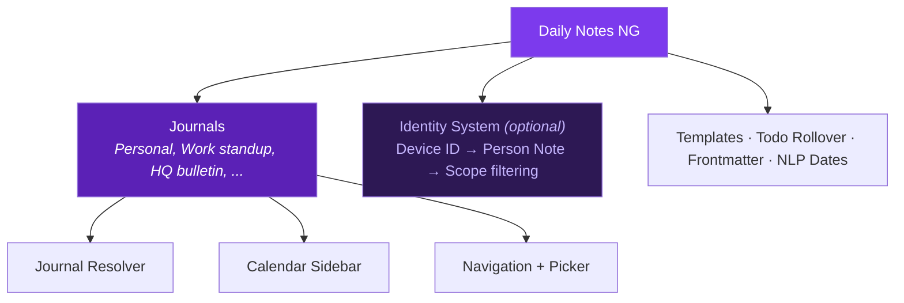

:::caution[Early development]
Daily Notes NG is in active early development. Features are being built, APIs may change, and rough edges exist. That said, **I use this plugin daily in my own vaults** — so it will be maintained. If no one else contributes, I will. Bug reports and feature requests are welcome on [GitHub](https://github.com/cybersader/obsidian-daily-notes-ng/issues).
:::

## Why Daily Notes NG?

The Obsidian daily notes ecosystem has a **maintenance crisis**. [Periodic Notes](https://github.com/liamcain/obsidian-periodic-notes) and [Calendar](https://github.com/liamcain/obsidian-calendar-plugin) have been abandoned for ~4 years with 151+ open issues. Users are forced to combine 5+ plugins for a complete workflow.

Daily Notes NG consolidates the best features into one plugin — and adds a **named journals** system and **multi-user identity** that no other daily notes plugin offers.

## Core concept: named journals

Unlike other periodic notes plugins that give you one folder per periodicity, Daily Notes NG lets you define **multiple named journals** — each with its own folder, template, periodicity, and ownership scope:

```
Your journals:
├── Personal        → Journal/Alice/Daily     (daily, person-scoped)
├── Work standup    → Teams/Dev/Standup       (daily, group-scoped)
├── Research log    → Research/Weekly          (weekly, person-scoped)
├── HQ bulletin     → HQ/Bulletin             (daily, global)
└── Team retro      → Teams/Dev/Retro         (weekly, group-scoped)
```

**Global journals** are available to everyone. **Person journals** only appear on registered devices. **Group journals** show for all group members. See [journals](/obsidian-daily-notes-ng/features/periodic-notes/).

## Features

- **[Named journals](/obsidian-daily-notes-ng/features/periodic-notes/)** — Multiple journals per vault with independent folder/template/periodicity configs
- **[Multi-user identity](/obsidian-daily-notes-ng/features/identity/)** — Device registration, person/group notes, creator attribution, per-person routing
- **[Calendar sidebar](/obsidian-daily-notes-ng/features/calendar/)** — Month-view calendar with dot indicators
- **[Folder-note mode](/obsidian-daily-notes-ng/guides/folder-notes/)** — Store notes as folders for attachment nesting, auto-generated .base MOC indexes
- **[Template integration](/obsidian-daily-notes-ng/features/templates/)** — Built-in variables + seamless Templater bridge
- **[Todo rollover](/obsidian-daily-notes-ng/features/todo-rollover/)** — Carry incomplete checkboxes from yesterday
- **[Frontmatter dates](/obsidian-daily-notes-ng/features/frontmatter-dates/)** — Auto-populate created/modified with smart debouncing
- **[Natural language dates](/obsidian-daily-notes-ng/features/natural-language-dates/)** — Type `@next friday` to insert date links inline

## Architecture



## For developers

Built with **Bun**, **TypeScript**, and **esbuild**. Includes [Obsidian CLI testing](/obsidian-daily-notes-ng/development/testing/), a [test fixtures plugin](/obsidian-daily-notes-ng/development/test-fixtures/), and [BRAT-compatible releases](/obsidian-daily-notes-ng/development/setup/).

See the [glossary](/obsidian-daily-notes-ng/concepts/glossary/) for terminology.
